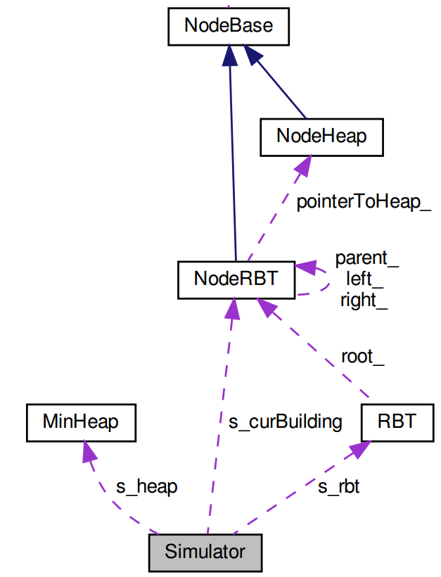

# Project of COP 5536 Fall 2019
Truc Nguyen (UFID: 9482-7764)

truc.nguyen@ufl.edu

## Usage
### Dependencies
- GCC >= 7.4.0

### Compile
```bash
$ make
```

### Execute
```bash
$ ./risingCity </path/to/input/file>
```
- `</path/to/input/file>`: path to the input text file

## Overall design
### Implementation methods
This project is implemented as a **discrete-event simulator**. There are two kinds of event:

1. Read the next command from the input file
2. Choose the building to work on

Each event is associated with a timestamp. At any point in time, the simulator will choose the event that has the smallest timestamp and update its global timestamp with that of the chosen event. The event loop of the simulator is implemented using the following pseudo-code:
```cpp
global_timestamp = 0;
while (there is some event)
{
    if (the timestamp of event 1 <= the timestamp of event 2)
    {
        // This is the event for reading the next command

        Update the executed_time of the current building

        global_timestamp = timestamp of event 1; // update the global time

        Read and execute the current command

        Update the timestamp of event 1 with the timestamp of the next command in the input file
    }
    else
    {
        // This is the event for choosing the next building

        Update the executed_time of the current building

        global_timestamp = timestamp of event 2; // update the global time

        if (the current building is finished)
            remove the building
        else
            Reinsert it to the heap

        Choose the next building to work on based on the min heap
        The timestamp of event 2 = global_timestamp + min(totalTime - executedTime, 5)
    }
}
```

As recommended by the TA, when choosing the building to work on, it will perform the `ExtractMin` operation on the min heap (i.e., remove the root of the heap and return that root). Note that it won't do anything to the red-black tree. After the 5-day period, the building will be inserted back to the min heap.

When the program encounters an `Insert` command, it will perform insertion on both the min heap and the red black tree.

For example:
```
0: Insert(50, 100)
2: Insert(51, 100)
3: Insert(52, 100)
4: Insert(53, 100)
```
At 0, the building 50 is inserted to the data structures, then chosen and extracted from the min heap. At 2, 3, and 4, the building 51, 52, and 53 is inserted to the data structure,respectively. The 50 will be inserted back to the heap at 5, and a new building will be chosen to build.

### Architectural overview
The architectural overview of the implementation is illustrated via the following class diagram



There are 6 main classes in this program:

- `Simulator`: this class implements the discrete-event simulator with the event loop. This is a static class and represents the main workflow of the program. The building that is currently being worked on is denoted as `s_curBuilding` and it is of type `NodeRBT`
- `NodeBase`: this is the base class (pure virtual) for representing a node/building. This class stores the building record `(buildingNums, executedTime, totalTime)` and implements some basic and virtual operations.
- `NodeHeap`: this class is derived from `NodeBase` and represents a node in the min heap. It implements some of the necessary methods for the heap structure.
- `NodeRBT`: this class is derived from `NodeBase` and represents a node in the red-black tree. It stores some additional attributes like color, parent, left child, and right child. It also stores a pointer to the corresponding node. Some of the necessary methods for the red-black tree are also implemented.
- `MinHeap`: this class implements the min heap structure using `NodeHeap` as its node. The heap is implemented as array-based.
- `RBT`: this class implements the red-black tree using `NodeRBT` as its node. All the operations are implemented in the same manner as the class lectures.
